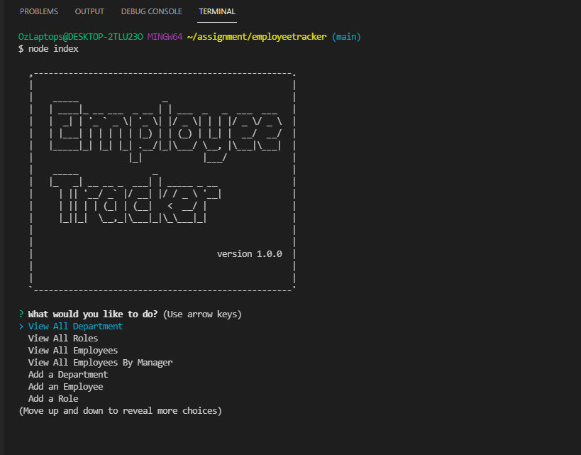

# MySQL: Employee Tracker

### Table of Contents

- [Description](#description)
- [Installation](#installation)
- [Usage](#usage)
- [Contribution](#contribution)
- [License](#license)

## Description

This project provides content management system for managing company's employees using node, inquirer and MySQL. This CMS gives you the following options:

- Add departments, roles, employees
- View departments, roles, employees
- Update employee roles
- Update employee managers
- View employees by manager

## Installation

- Run npm install to install all dependencies
- Run schema.sql in MySQLWorkbench
- Run index.js

## Usage

For instruction on how to use this project, please refer to walk-through video.

## Contribution

Please feel free in making contribution to this repository. But please first discuss the change via email with me. I will try to get back to you as soon as possible.

## Mock up

## Walk Through Video

##### Video: [TeamProfile Generator Walk-through](https://drive.google.com/file/d/1vY416ZOJ_jlS4nKX5o9N84cZ1rIIUCEE/view)

## Questions

If you have any questions feel free to contact me:

Github Username: sona29

Email: sona.shrestha004@gmail.com

## License

